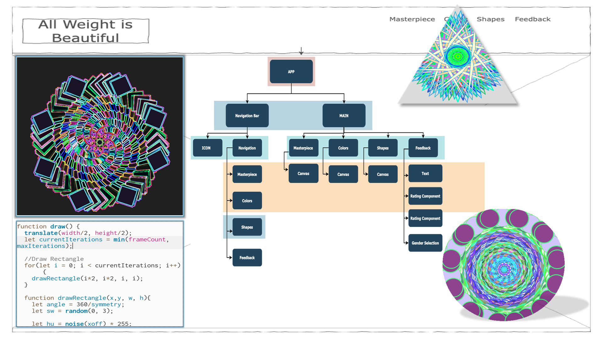

### Name: ###
## Isadora Fitzgerald ##
### Student Id: ###
## W20099887 ##
### Video URL: ###
# [Video Presentation](https:) # 
### Commercial Title: ### 
# All Weight is Beautiful #
### Academic Title: ###
# Interactive Art Generator using a digital weighing Scale A.P.I. #
### Abstract: ###
## “All weight is beautiful” illustrates the fusion of Art and Computer Science in a quirky and unique Art Gallery web app prototype of a larger interactive public art installation. An anonymous user simply steps on a weighing scale allowing the scales API to gather a dataset from the users' interaction with the scales. Using this extracted dataset, P5.js is integrated into a React component of the web app gallery and outputs a visualisation via random numbers and patterns emulating Kaleidoscope type imagery - a multi-faceted, symmetrical, colourful image based on a shape. ##
### Keywords: ###
+ Weighing scale 
+ Scales API
+ Dataset
+ .json
+ P5.js
+ React components
+ Shapes
+ Web app gallery
+ Random numbers and patterns
+ Kaleidoscope type images

### Image: ###
### _The below Image shows an overview of the Kaleidoscope type imagery envisioned._ ###

### Project managment: ###
### Please visit [Trello](https://trello.com/invite/b/6aBvTRjd/ATTId0ebfddabef951228f6f0146e951686f2CB6CA20/final-year-project)  ###
### Final Report: ###
